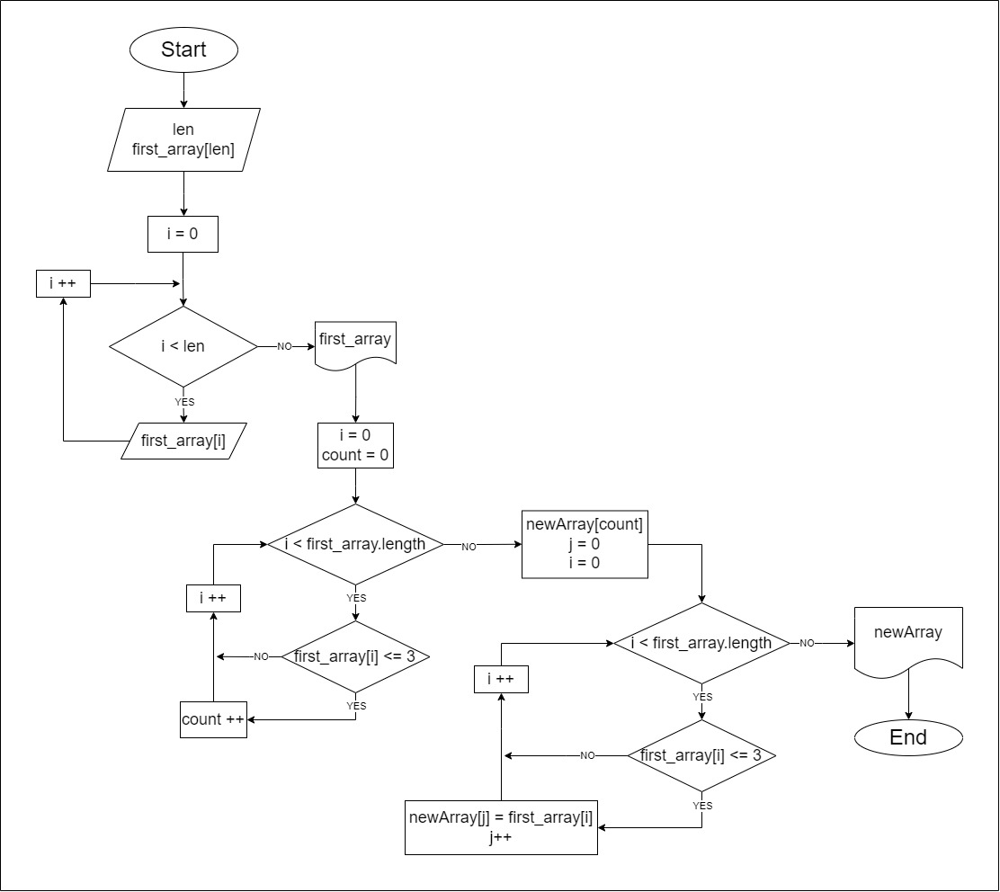

# Пояснение решения итоговой контрольной работы по основному блоку

## Условие

_**Задача**_: Написать программу, которая из имеющегося массива строк формирует новый массив из строк, длина которых меньше, либо равна 3 символам. Первоначальный массив можно ввести с клавиатуры, либо задать на старте выполнения алгоритма. При решении не рекомендуется пользоваться коллекциями, лучше обойтись исключительно массивами.

## Решение

Решение данной задачи разделим на два этапа:
* __Создание блок-схемы__
* __Написание кода__

Разберем подробнее каждый из этапов

### Блок-схема

Блок-схема решения задачи представленна на изображении ниже:



После построения блок-схемы перейдём к написанию кода, соответствующего решению на изображении

### Код

1. Первым делом мы реализуем функцию, с помощью которой задаём размер массива и сам массив элементов с клавиатуры.

2. Далее создаём функцию для вывода любого обозначенного массива и выводим с её помощью наш первоначальный массив для наглядности результата в дальнешем.

3. Следующим шагом реализуем функцию, которая создаёт новый массив, в котором все елементы имеют длину не больше 3. 

        Методика данной функции заключается в том, что изначально мы просто считаем сколько элемнтов первоначального массива удовлетворяют поставленному условию. А далее мы уже объявляем новый массив известной нам уже длины, и заполняем его элементами первоначального массива, удовлетворяющими условию.

4. Ну в последнемм этапе мы реализуем основную часть, которая отвечает за взимодействие описаных выше методов и взаимодействие пользователя с программой.

        
```fix
Конец :)
```